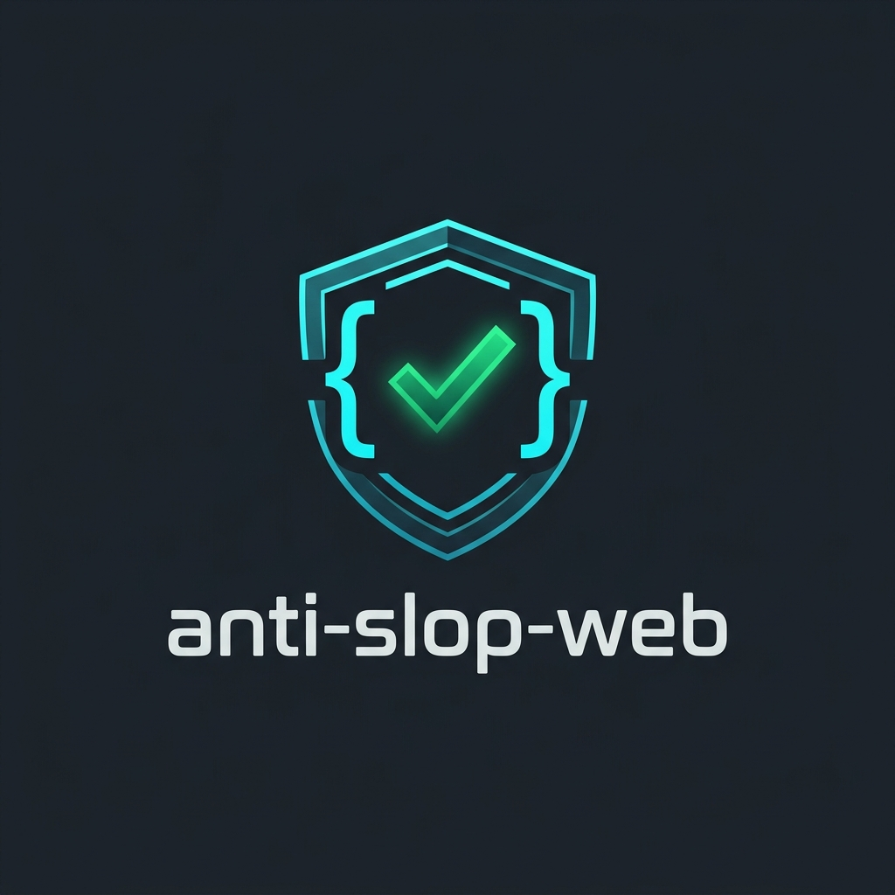

<p align="center">
  
</p>

# anti-slop-web

An AI Agent Skill that enforces production-grade security, data integrity, modern architecture, and software engineering standards when generating or reviewing web applications.

[](LICENSE)
[](CONTRIBUTING.md)

---

## Overview

AI code generators produce code that runs, but frequently omit critical production controls that senior engineers apply by default:

* **Resource-level authorization checks**: Verifying authentication while omitting user ownership validation (IDOR/BOLA).
* **Next.js Server Action traps**: Treating public `"use server"` endpoints like private local functions without input parsing or session ownership checks.
* **RSC payload over-fetching**: Passing raw ORM database objects to `"use client"` components, exposing sensitive internal database fields.
* **Unbounded AI/LLM API features**: Missing rate limits, missing token caps, and exposing private API keys in client-side bundles.
* **Superficial validation**: Catch blocks that swallow errors, unchecked type assertions, and missing server-side schema parsing.
* **Database and state vulnerabilities**: Serverless connection exhaustion, missing multi-tenant query filters, and unhandled race conditions on state mutations.

`anti-slop-web` is a structured instruction set compatible with Claude Code, Cursor, Windsurf, and Gemini/Antigravity agents. It forces agents to audit every generated endpoint, component, and query against senior engineering standards before marking tasks complete.

---

## Installation

### 1. Cursor (1-Click or MDC Rule)
* **Official Registry**: Install directly from [**Cursor Directory: anti-slop-web**](https://cursor.directory/plugins/anti-slop-web).
* **Manual setup**: Copy `SKILL.md` or `rules/anti-slop-web.mdc` to your workspace `.cursor/rules/`:
  ```bash
  mkdir -p .cursor/rules
  cp rules/anti-slop-web.mdc .cursor/rules/anti-slop-web.mdc
  ```

### Claude Code CLI & Agent Frameworks
Clone into your project's `.agents/skills` directory:

```bash
mkdir -p .agents/skills
git clone https://github.com/TirupMehta/anti-slop-web.git .agents/skills/anti-slop-web
```

Or copy globally to `~/.gemini/config/skills/anti-slop-web/`.

### Windsurf & Other Agents
Reference `SKILL.md` directly in your workspace instructions (`.windsurfrules` or `AGENTS.md`).

---

## Code Generation Baseline: Before and After

### Default AI Output (Server Action Slop)
```typescript
// Unsecure: Missing authorization, missing input validation, leaks DB errors
"use server";

export async function deleteDocument(documentId: string) {
  // Exploit: Any user can delete any document by invoking deleteDocument("doc_123")
  await db.delete(documents).where(eq(documents.id, documentId));
}
```

### Enforced by `anti-slop-web`
```typescript
// Enforced: Input schema validation, session verification, dual-scoped query ownership
"use server";

import { z } from "zod";
import { auth } from "@/lib/auth";

const deleteSchema = z.object({ documentId: z.string().min(1) });

export async function deleteDocument(rawInput: unknown) {
  const session = await auth();
  if (!session?.user?.id) throw new Error("Unauthorized");

  const { documentId } = deleteSchema.parse(rawInput);

  const deleted = await db
    .delete(documents)
    .where(and(eq(documents.id, documentId), eq(documents.userId, session.user.id)))
    .returning();

  if (deleted.length === 0) {
    throw new Error("Document not found or permission denied");
  }

  return { success: true };
}
```

---

## Core Non-Negotiables

Every piece of code touched by this skill must satisfy these baseline requirements:

1. **Zero hardcoded secrets**: Credentials, keys, and tokens must use environment variables.
2. **Parameterized database access**: Zero string-concatenated SQL queries under any circumstance.
3. **Password hashing**: Use `argon2id` or `bcrypt` (cost ≥ 12).
4. **Server-side validation**: All external inputs must be parsed against a Zod schema server-side.
5. **Masked stack traces**: Internal paths and raw database errors must never reach client responses.
6. **Explicit authorization boundaries**: Every mutating route/endpoint/action MUST check resource ownership (`userId`/`workspaceId`), not just authentication status.
7. **Server Action security**: Next.js Server Actions (`"use server"`) are public HTTP POST endpoints — parse inputs and check authorization inside every action body.
8. **RSC payload protection**: Never pass raw database objects to Client Components (`"use client"`). Project explicit DTOs.
9. **Boot-time environment validation**: Fail fast on app startup if required secrets are missing using schemas (`@t3-oss/env-nextjs`/`@t3-oss/env-core`).
10. **Multi-tenant query scoping**: Dual-scope every query with `workspaceId`/`tenantId` at the data layer.
11. **Serverless connection pooling**: Use connection poolers or global singletons for serverless DB drivers to prevent connection exhaustion.
12. **AI API key & cost protection**: Never expose AI keys on client bundles (`NEXT_PUBLIC_*`). Enforce rate limits and `max_tokens` caps.
13. **Maintained dependencies**: Do not introduce deprecated, unmaintained, or vulnerable packages.
14. **Strict TypeScript**: No unannotated `any` types.
15. **Handled async promises**: No silent promise swallows in catch blocks.
16. **Complete UI states**: Data-fetching components must handle loading, empty, error, and optimistic rollback states.
17. **Data integrity**: State mutations (payments, orders) must be protected against duplicate execution at the data layer.
18. **Honest confidence & self-verification**: Run type checks (`tsc --noEmit`) and linter before declaring tasks complete.

---

## Reference Architecture

The primary [`SKILL.md`](SKILL.md) routes tasks to targeted reference documents:

| Task Type | Reference Document | Primary Focus |
|---|---|---|
| Frontend UI / Components | [`accessibility-design.md`](references/accessibility-design.md), [`code-quality.md`](references/code-quality.md) | WCAG AA accessibility, state management, micro-interactions |
| Next.js Server Actions & RSC | [`nextjs-server-actions.md`](references/nextjs-server-actions.md) | Public POST security, RSC payload DTOs, server-only isolation |
| Backend & APIs | [`security.md`](references/security.md), [`testing.md`](references/testing.md) | OWASP security, authorization boundaries, edge testing |
| AI / LLM Integrations | [`ai-llm-integrations.md`](references/ai-llm-integrations.md) | Secret key isolation, rate limiting, token caps, streaming errors |
| WebSockets & Real-Time | [`realtime-websockets.md`](references/realtime-websockets.md) | Handshake auth, room boundaries, unmount subscription cleanup |
| Environment Setup | [`environment-boot-validation.md`](references/environment-boot-validation.md) | Boot-time schema validation, client/server secret separation |
| Multi-Tenant & Serverless DB | [`multi-tenant-data-isolation.md`](references/multi-tenant-data-isolation.md) | Workspace scoping, soft-deletes, serverless connection pooling |
| Database & State Mutations | [`data-integrity.md`](references/data-integrity.md), [`performance.md`](references/performance.md) | Idempotency, atomic operations, query optimization |
| Audits & Code Reviews | [`review-mode.md`](references/review-mode.md), [`loopholes.md`](references/loopholes.md) | Detection of checklist rationalizations and TODO stubs |
| Project Scaffolding | [`stack-defaults.md`](references/stack-defaults.md), [`architecture-future-proofing.md`](references/architecture-future-proofing.md) | Ecosystem defaults, clean abstractions, operations |

---

## Contributing

Please review [`CONTRIBUTING.md`](CONTRIBUTING.md) for details on submitting pull requests, updating reference manuals, and reporting issues.

## License

Distributed under the [MIT License](LICENSE).
